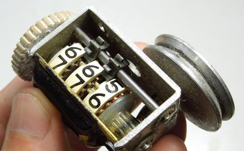

# counter-kata

Un kata créé par [Thomas Genet](http://people.irisa.fr/Thomas.Genet)

On souhaite représenter un compteur basé sur les même principes que les compteurs mécaniques composés de
roues. Cependant, contrairement aux compteurs usuels, on ne supposera pas que les roues ont toutes le même nombre
de valeurs possibles. Un compteur pourra être initialisé avec une liste de valeurs maximales pour chaque roue : une
liste non vide de valeurs supérieures ou égales à 0. Comme dans les compteurs mécaniques, lorsqu’une roue aura fait
un tour complet, elle fera avancer d’un cran la roue située à sa gauche (si elle existe). L'interface Counter comprend les
opérations suivantes :

* _init(l: List<Int>)_ qui initialise le compteur comme décrit ci-dessus ;
* _current(): List<Int>_ qui retourne la liste de valeurs courante du compteur ;
* _next()_ qui incrémente le compteur. Si on a atteint le maximum, le compteur est bloqué sur la dernière
valeur comptée ;
* _hasNext(): Boolean_ qui dit s’il est encore possible d’incrémenter le compteur ou s’il a atteint la valeur
maximum ;
* _nbPossibleValues(): Int_ qui donne le nombre total de valeurs que le compteur peut prendre tel qu’il est
initialisé ;
* _nbRemainingValues(): Int_ qui donne le nombre d’incréments que peut encore réaliser le compteur.

Implémentez ces méthodes en TDD.
